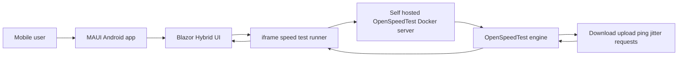
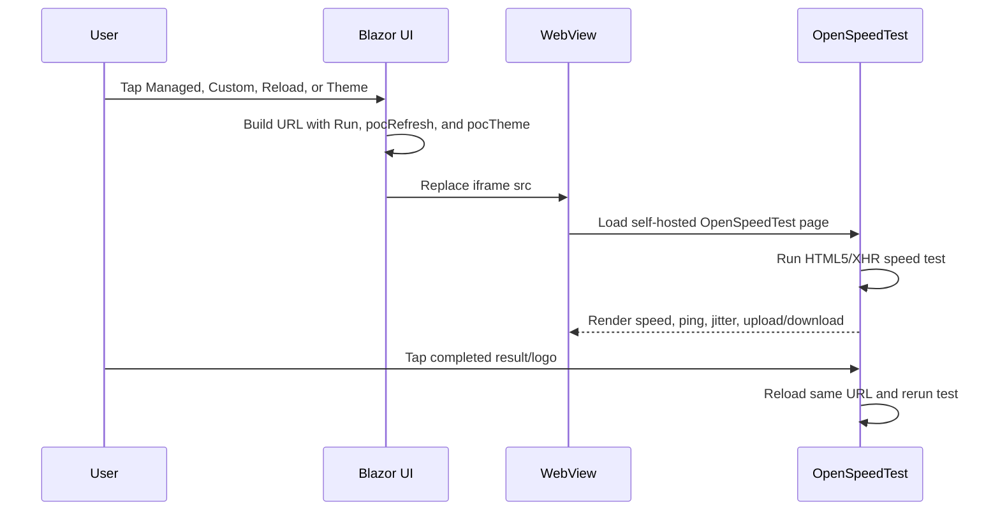

# FTAP OpenSpeedTest POC

Hybrid .NET MAUI Mobile App proof of concept for running a self-hosted OpenSpeedTest experience inside an Android-focused Blazor Hybrid shell.

This project is based on the open-source OpenSpeedTest HTML5/XHR engine and uses Ookla Speedtest only as a UX reference point. It does not include Ookla code, SDKs, trademarks as app branding, or private Ookla APIs.

## What This POC Does

- Runs a .NET MAUI Blazor Hybrid mobile app targeting Android.
- Embeds a self-hosted OpenSpeedTest instance in an in-app `iframe`.
- Defaults to dark mode for the whole app and for the embedded OpenSpeedTest page.
- Supports a managed server button, a custom server button, one reload/start button, and one light/dark theme button in a single top-right control row.
- Uses `http://10.0.2.2:3000` by default so an Android emulator can reach Docker running on the Windows host.
- Allows custom HTTP or HTTPS OpenSpeedTest server URLs.
- Prevents the embedded OpenSpeedTest surface from navigating out to the public OpenSpeedTest website during normal use.
- Lets a user tap the completed OpenSpeedTest result/logo area to rerun the test.
- Includes a debug-signed Android APK in `release/FTAP-OpenSpeedTest-POC-debug-signed.apk`.

## Screenshots

### Dark Mode


### Light Mode


### Completed Test


### Tap Completed Result To Rerun


## High-Level Architecture



## Runtime Flow



## Repository Layout

```text
.
|-- Components/
|   |-- Pages/Home.razor                 # Main Blazor Hybrid UI and control logic
|   |-- Pages/NotFound.razor
|   |-- Layout/MainLayout.razor
|   `-- Routes.razor
|-- Platforms/Android/AndroidManifest.xml # Internet and cleartext settings
|-- docker-overrides/                    # POC-patched OpenSpeedTest static assets
|-- docs/
|   |-- TECHNICAL_DOCUMENTATION.md
|   `-- images/                          # GitHub documentation screenshots
|-- release/
|   `-- FTAP-OpenSpeedTest-POC-debug-signed.apk
|-- docker-compose.yml                   # Self-hosted OpenSpeedTest with POC overrides
|-- HybridSpeedTestPoc.csproj
|-- MainPage.xaml
|-- MainPage.xaml.cs
`-- wwwroot/app.css
```

## Prerequisites

- Windows with .NET SDK and .NET MAUI workload installed.
- Android SDK, platform tools, and an Android emulator or Android device.
- Docker Desktop.
- GitHub CLI only if you plan to publish changes.

Check local tooling:

```powershell
dotnet --info
dotnet workload list
docker --version
adb version
```

## Run The Self-Hosted OpenSpeedTest Server

The easiest path is Docker Compose from the repository root:

```powershell
docker compose up -d
```

This starts `openspeedtest/latest` and mounts the POC override files from `docker-overrides/` into the Nginx static web root.

Verify the server from Windows:

```powershell
curl http://localhost:3000
```

From the Android emulator, the Windows host is reached through:

```text
http://10.0.2.2:3000
```

From a physical phone on the same LAN, use the Windows host IP, for example:

```text
http://192.168.1.25:3000
```

## Build The Android App

Build Android:

```powershell
dotnet build -f net10.0-android
```

Build, install, and run on the currently connected emulator:

```powershell
dotnet build -t:Run -f net10.0-android -p:EmbedAssembliesIntoApk=true
```

The Android package id is:

```text
com.ftap.openspeedtestpoc
```

## Install The Included APK

The repository includes a debug-signed APK for POC testing:

```powershell
adb install -r release\FTAP-OpenSpeedTest-POC-debug-signed.apk
```

Launch it:

```powershell
adb shell monkey -p com.ftap.openspeedtestpoc 1
```

## App Controls

| Icon | Purpose | Behavior |
| --- | --- | --- |
| Cloud | Managed | Uses `http://10.0.2.2:3000` and starts the test. |
| Server | Custom | Shows the custom server URL field. |
| Reload | Reload/start | Rebuilds the iframe URL with `Run=1` and starts a fresh test. |
| Sun/Moon | Theme | Toggles light/dark mode for the app shell and embedded OpenSpeedTest page. |

## Custom Server Rules

The custom server field accepts:

- `http://host:port`
- `https://host`
- `host:port`, which the app normalizes to `http://host:port`

The app rejects:

- Empty input.
- Non-HTTP schemes such as `ftp://` or `file://`.
- Invalid URL syntax.

## Important Implementation Notes

- Android cleartext traffic is enabled because local Docker testing commonly uses plain HTTP.
- Android WebView mixed content is allowed so the app can load a local HTTP speed-test server during POC validation.
- `pocTheme=dark|light` is appended to the OpenSpeedTest URL so the Docker override can apply the matching theme.
- `Run=1` starts the OpenSpeedTest engine automatically.
- `pocRefresh=<number>` prevents WebView caching from making reload/start look stale.
- The OpenSpeedTest logo/result surface is patched to start or rerun the test instead of navigating to an external website.
- Public OpenSpeedTest result-sharing URL generation is disabled in the Docker override for this POC.

## Validation Summary

The following scenarios were validated locally before publishing:

| Scenario | Expected result | Status |
| --- | --- | --- |
| Android build | `dotnet build -f net10.0-android` succeeds. | Passed |
| Emulator deploy/run | `dotnet build -t:Run ...` installs and opens the app. | Passed |
| Docker server | `openspeedtest/latest` serves on `localhost:3000`. | Passed |
| Managed mode | Loads `http://10.0.2.2:3000` in the emulator and starts. | Passed |
| Custom mode | Accepts custom HTTP/HTTPS URL and reloads iframe. | Passed |
| Invalid custom URL | Shows validation and does not replace iframe with bad URL. | Passed |
| Dark to light theme | App shell and embedded speed-test page switch together. | Passed |
| Light to dark theme | App shell and embedded speed-test page switch together. | Passed |
| Completed result tap | Tapping completed OpenSpeedTest area reruns instead of opening an external website. | Passed |
| Manual embedded start then completed tap | Completed-result rerun still forces `Run=1` even if the previous test was started inside the iframe. | Passed |
| Link navigation | Search verified no external link launch behavior in the POC overrides. | Passed |

For the full validation and edge-case checklist, see [docs/TECHNICAL_DOCUMENTATION.md](docs/TECHNICAL_DOCUMENTATION.md).

## Known POC Limitations

- The included APK is debug-signed and intended for proof-of-concept testing only.
- The project targets Android only (`net10.0-android`) to keep Visual Studio and Razor tooling focused on the emulator workflow.
- Production distribution should use a release signing key, stricter network security configuration, and a stable OpenSpeedTest server endpoint.
- This POC does not attempt to match Ookla feature parity. It uses Ookla as a UX reference only.

## Credits

- OpenSpeedTest open-source project: https://github.com/openspeedtest/Speed-Test
- OpenSpeedTest public site and self-hosting reference: https://openspeedtest.com/
