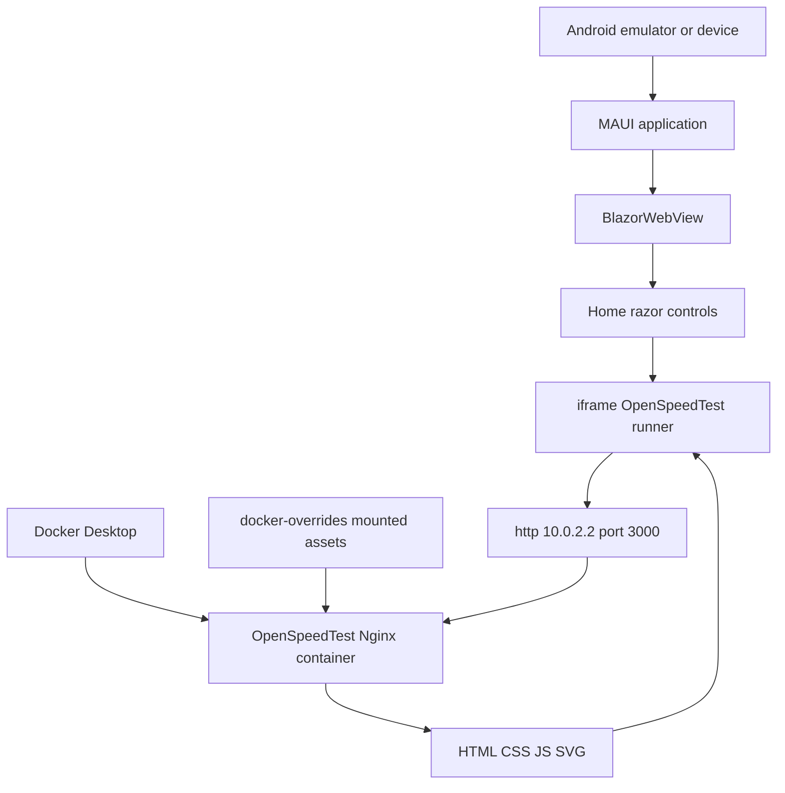
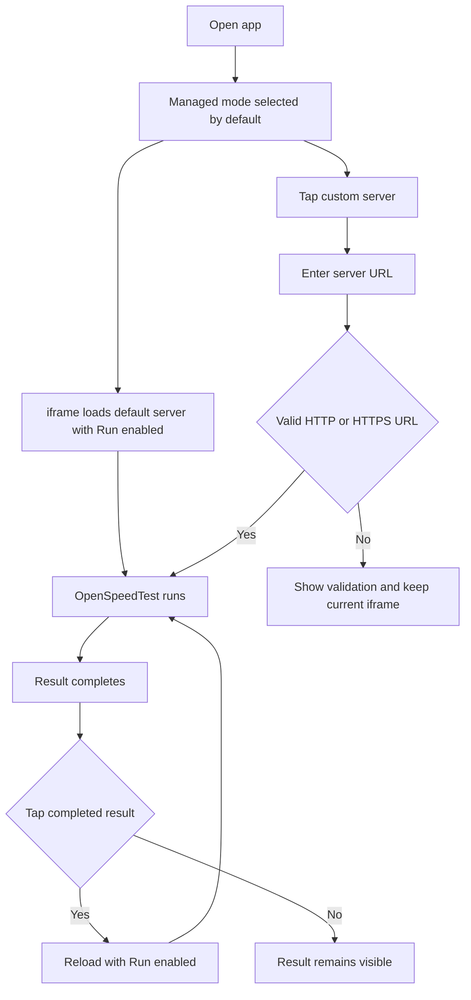
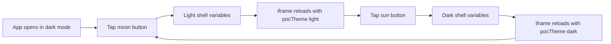
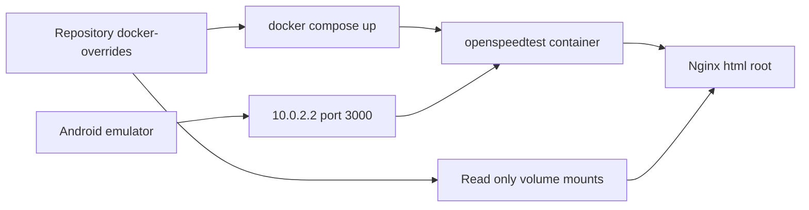
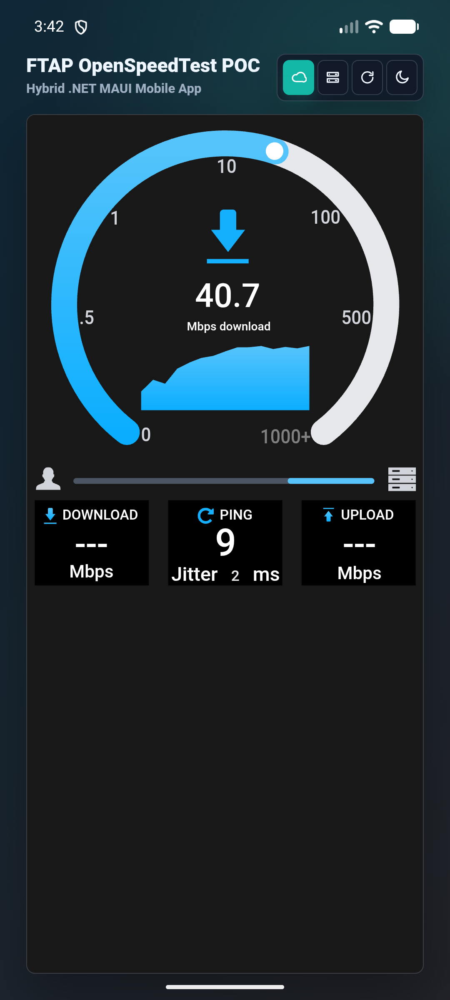
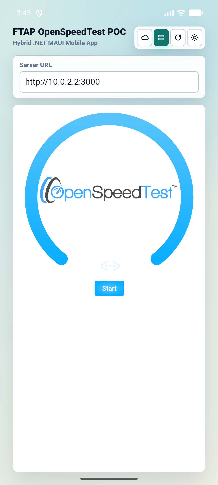
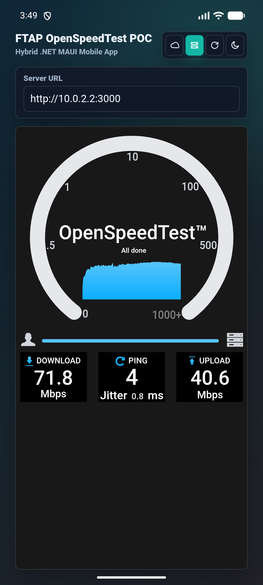
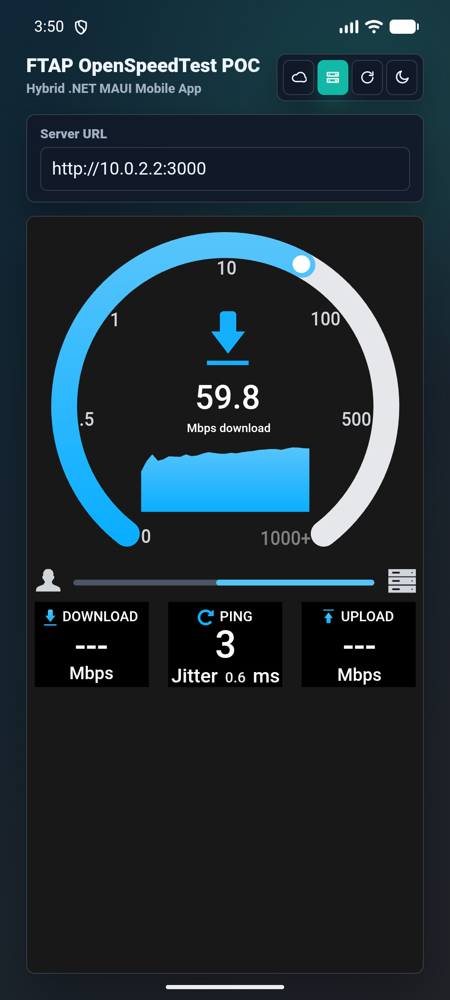

# FTAP OpenSpeedTest POC Technical Documentation

This document explains the full proof-of-concept design, runtime behavior, setup process, test plan, validation results, edge cases, and maintenance notes for the FTAP OpenSpeedTest POC.

## 1. Purpose And Scope

The goal is to prove that a hybrid .NET MAUI Android mobile app can host an OpenSpeedTest-based speed-test experience while still controlling the surrounding mobile UX:

- FTAP-branded mobile shell.
- Dark mode by default.
- Managed and custom server modes.
- One-row icon controls.
- Embedded OpenSpeedTest test runner.
- No accidental navigation to the public OpenSpeedTest website.
- Docker-based local/self-hosted server for repeatable development.

The POC intentionally uses the open-source OpenSpeedTest engine as the implementation base. Ookla Speedtest is only a product/UX reference.

## 2. Architecture



### Runtime Boundaries

| Layer | Responsibility |
| --- | --- |
| .NET MAUI | Native Android app host, package metadata, permissions, WebView configuration. |
| Blazor Hybrid | App layout, controls, validation, URL construction, theme state. |
| OpenSpeedTest iframe | Actual speed-test UI and XHR network measurements. |
| Docker OpenSpeedTest | Local repeatable OpenSpeedTest server served through Nginx. |
| Docker overrides | POC-specific styling, theme sync, no-link behavior, completed-result rerun behavior. |

## 3. Source Components

### `HybridSpeedTestPoc.csproj`

Defines the MAUI project, target frameworks, app title, app identifier, and package dependencies.

Important values:

```xml
<TargetFramework>net10.0-android</TargetFramework>
<ApplicationTitle>FTAP OpenSpeedTest POC</ApplicationTitle>
<ApplicationId>com.ftap.openspeedtestpoc</ApplicationId>
```

### `MainPage.xaml`

Hosts a `BlazorWebView` and maps the Blazor root component to `#app` in `wwwroot/index.html`.

### `MainPage.xaml.cs`

Sets Android WebView mixed-content handling:

```csharp
e.WebView.Settings.MixedContentMode = MixedContentHandling.AlwaysAllow;
```

This is required for the POC because Android WebView can otherwise block local HTTP content. A production version should prefer HTTPS and stricter network security.

### `Platforms/Android/AndroidManifest.xml`

Adds:

- `android.permission.INTERNET`
- `android.permission.ACCESS_NETWORK_STATE`
- `android:usesCleartextTraffic="true"`

Cleartext traffic is required for local Docker testing over `http://10.0.2.2:3000`.

### `Components/Pages/Home.razor`

This is the main app experience.

Responsibilities:

- Render FTAP title and subtitle.
- Render the single-row icon controls.
- Track managed vs custom mode.
- Validate custom server URLs.
- Build iframe URLs with the right query parameters.
- Keep light/dark shell state synchronized with the embedded OpenSpeedTest page.

### `wwwroot/app.css`

Defines the responsive app shell, dark/light tokens, header sizing, button styling, custom URL panel, validation state, and iframe shell.

### `docker-overrides/*`

These files are mounted into the OpenSpeedTest Docker container:

| File | Purpose |
| --- | --- |
| `index.html` | Adds POC title, theme bootstrap script, and cache-busted asset references. |
| `ost-app.css` | POC-adjusted OpenSpeedTest layout and dark/light safe colors. |
| `darkmode.css` | Dark mode override for the OpenSpeedTest page. |
| `darkmode.js` | Theme cookie/script support from the OpenSpeedTest page. |
| `app.svg` | Patched SVG interactions and visual behavior. |
| `app-2.5.4.js` | Patched engine behavior for no-link start/rerun and completed-result reload. |

## 4. URL Contract

The Blazor app builds the iframe URL with three POC-specific concerns:

```text
http://10.0.2.2:3000?Run=1&pocRefresh=1&pocTheme=dark
```

| Query parameter | Purpose |
| --- | --- |
| `Run=1` | Tells OpenSpeedTest to start automatically. |
| `pocRefresh=<number>` | Forces a fresh iframe load and avoids stale WebView cache behavior. |
| `pocTheme=dark` or `pocTheme=light` | Lets the OpenSpeedTest override apply the same theme as the MAUI shell. |

Existing query strings are preserved. For example:

```text
http://server:3000?foo=bar
```

becomes:

```text
http://server:3000?foo=bar&Run=1&pocRefresh=2&pocTheme=dark
```

## 5. User Workflow



## 6. Theme Workflow



Important behavior:

- The app defaults to dark mode in both MAUI and Blazor state.
- The theme button is the last button in the upper-right row.
- The embedded OpenSpeedTest page reloads when the theme changes so the middle test surface changes as well.
- The internal OpenSpeedTest sun/moon button is removed from the visible test surface to avoid duplicate controls.
- Public OpenSpeedTest result-sharing URL generation is disabled in the POC override.

## 7. Docker Process Flow



Recommended command:

```powershell
docker compose up -d
```

Manual fallback:

```powershell
docker run --restart=unless-stopped --name openspeedtest -d -p 3000:3000 -p 3001:3001 openspeedtest/latest
```

If using the manual fallback, copy the override files into the running container or prefer Compose so the mounted files are automatic and repeatable.

## 8. Setup From Fresh Clone

1. Clone the repository.

```powershell
git clone https://github.com/rgalor-ca/ftap-openspeedtest-poc.git
cd ftap-openspeedtest-poc
```

2. Start OpenSpeedTest.

```powershell
docker compose up -d
```

3. Validate Docker from Windows.

```powershell
curl http://localhost:3000
```

4. Start an Android emulator.

```powershell
emulator -avd OpenSpeed_POC_API_37
```

5. Build and run.

```powershell
dotnet build -t:Run -f net10.0-android -p:EmbedAssembliesIntoApk=true
```

6. Confirm the app opens with:

- FTAP title on upper left.
- Subtitle below it.
- One-row controls on upper right.
- Dark mode by default.
- OpenSpeedTest iframe in the middle.
- Test starts automatically.

## 9. Custom Server Instructions

Use custom mode when the OpenSpeedTest server is not the default local Docker instance.

### Android Emulator

Use:

```text
http://10.0.2.2:3000
```

### Physical Android Device

Use the Windows host LAN IP:

```text
http://<host-lan-ip>:3000
```

Example:

```text
http://192.168.1.25:3000
```

The phone and host machine must be on the same reachable network. Windows Firewall must allow the Docker-exposed port.

### Remote Server

Use HTTPS when possible:

```text
https://speedtest.example.com
```

## 10. Validation And Edge Cases

### Build And Packaging

| Case | Why it matters | Expected behavior |
| --- | --- | --- |
| Android build | Ensures source compiles after cleanup. | Build succeeds. |
| Android run target | Ensures emulator deployment still works. | App installs and opens. |
| APK artifact exists | User requested APK in GitHub. | `release/FTAP-OpenSpeedTest-POC-debug-signed.apk` is present. |
| Removed template files | Confirms cleanup did not remove used routes. | Home page still renders; build succeeds. |

### Network Cases

| Case | Why it matters | Expected behavior |
| --- | --- | --- |
| Docker unavailable | Common local setup issue. | iframe shows server load failure; app shell remains usable. |
| Docker available on localhost | Baseline managed POC path. | Emulator reaches server through `10.0.2.2`. |
| Physical phone on LAN | Needed outside emulator. | User enters host LAN IP in custom mode. |
| HTTP endpoint | Required for local Docker. | Allowed by manifest and WebView mixed-content setting. |
| HTTPS endpoint | Preferred for remote/custom. | Accepted if URL is valid. |
| Non-HTTP URL | Prevents unsafe or unsupported WebView targets. | Validation message, iframe unchanged. |
| Empty custom URL | Prevents blank navigation. | Validation message, iframe unchanged. |
| Missing scheme | User convenience. | `host:port` becomes `http://host:port`. |
| Existing query string | Custom servers may require options. | Existing query is preserved before POC parameters. |

### UI Cases

| Case | Why it matters | Expected behavior |
| --- | --- | --- |
| Small mobile width | Header must not wrap into multiple rows. | Title/subtitle stay one line; controls stay one row. |
| Dark default | User requested default dark mode. | App opens dark. |
| Light toggle | User requested full app and middle theme switch. | Shell and iframe change to light. |
| Dark toggle | Must be reversible. | Shell and iframe change back to dark. |
| Managed button | Quick default server path. | Active state changes and test starts. |
| Custom button | Enables user-provided server. | URL field appears without forcing bad reload. |
| Reload/start button | User requested one combined icon. | iframe reloads with `Run=1`. |
| Completed result tap | User requested no website navigation. | Test reruns from the embedded page. |
| Completed tap after manual embedded start | Covers theme-only iframe loads that do not already have `Run=1`. | Rerun URL forces `Run=1` and starts immediately. |

### External Navigation Cases

| Case | Why it matters | Expected behavior |
| --- | --- | --- |
| Tap OpenSpeedTest logo before run | Avoids leaving app. | Starts test. |
| Tap OpenSpeedTest completed result | Avoids public site navigation. | Reruns test. |
| Tap completed status text | Alternate target inside SVG/DOM. | Reruns test with `Run=1`. |
| Search for `window.open`/external link handlers | Catches regressions. | No active external launch handlers in POC override code. |

## 11. Verification Commands

Run these before publishing changes:

```powershell
dotnet build -f net10.0-android
docker compose config
rg "com\\.example|Counter|Weather|NavMenu|dotnet_bot|bootstrap" -n -g "!bin/**" -g "!obj/**" -g "!artifacts/**"
rg "window\\.open|location\\.href|href='https://openspeedtest|href=\"https://openspeedtest" docker-overrides -n
```

Run and deploy to emulator:

```powershell
dotnet build -t:Run -f net10.0-android -p:EmbedAssembliesIntoApk=true
```

Validate installed package:

```powershell
adb shell pm list packages | findstr ftap
adb shell monkey -p com.ftap.openspeedtestpoc 1
```

Capture screenshot:

```powershell
adb exec-out screencap -p > artifacts\latest.png
```

## 12. Visual Validation

### Dark Mode



### Light Mode



### Completed Result



### Rerun After Completion Tap



## 13. Troubleshooting

### The emulator cannot load the speed test

Check Docker:

```powershell
docker ps --filter "name=openspeedtest"
curl http://localhost:3000
```

Confirm the app is using:

```text
http://10.0.2.2:3000
```

Do not use `localhost` inside the Android emulator. Inside the emulator, `localhost` means the emulator itself, not Windows.

### A physical phone cannot load the speed test

Use the Windows LAN IP, not `10.0.2.2`.

Check:

- Phone and Windows host are on the same network.
- Windows Firewall allows inbound traffic to port `3000`.
- Docker is publishing port `3000`.

### Theme changes only the app shell

The iframe must reload with `pocTheme=dark` or `pocTheme=light`. Check `Home.razor` URL construction and `docker-overrides/index.html` theme bootstrap script.

### Tapping OpenSpeedTest opens a website

Check `docker-overrides/app.svg` and `docker-overrides/app-2.5.4.js`. The POC patches should start or rerun the test instead of navigating externally.

### Build fails after deleting template files

Run:

```powershell
rg "Counter|Weather|NavMenu|dotnet_bot|bootstrap" -n -g "!bin/**" -g "!obj/**"
```

Any remaining source reference should be removed or replaced with the active `Home.razor` flow.

## 14. Security And Production Notes

This is a POC configuration. Before production:

- Use a release signing key, not the debug key.
- Prefer HTTPS for every custom server endpoint.
- Replace broad cleartext/mixed-content allowances with a narrow Android network security config.
- Decide whether the OpenSpeedTest server is managed internally, deployed per environment, or user-configurable.
- Review OpenSpeedTest upstream license and attribution requirements for distribution.
- Add automated UI tests if the POC moves beyond manual validation.

## 15. Maintenance Checklist

Before each release candidate:

1. Rebuild Android.
2. Run Docker Compose config validation.
3. Start Docker and validate `localhost:3000`.
4. Deploy to emulator and verify managed mode.
5. Verify custom URL validation.
6. Toggle dark to light and light to dark.
7. Complete a speed test and tap the completed result to rerun.
8. Search the Docker override files for accidental external navigation.
9. Package a fresh signed APK into `release/`.
10. Update screenshots if UI changed.
